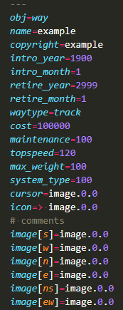
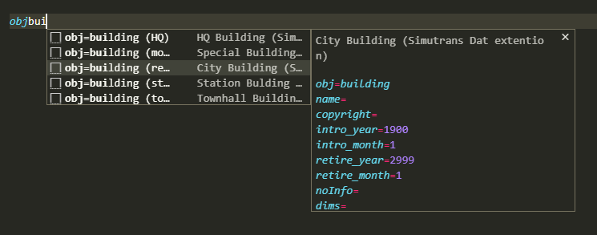

# simutrans-vscode-extention

> [!WARNING]
> **This extension is deprecated.** It has been replaced by
> [**Simutrans dat_linter**](https://marketplace.visualstudio.com/items?itemName=128na.simutrans-dat-linter)
> ([source](https://github.com/128na/simutrans-dat-linter)), which provides the same syntax
> highlighting and snippets — generated mechanically from the linter's own data instead of
> hand-collected from the wiki — plus diagnostics (Problems panel) and document formatting.
>
> Please uninstall this extension and install the new one instead. Installing both at the same
> time can cause inconsistent highlighting, since both contribute a language/grammar for `.dat`
> files.

This extension provides syntax highlighting and snippets.

## syntax highlighting

## snippets

